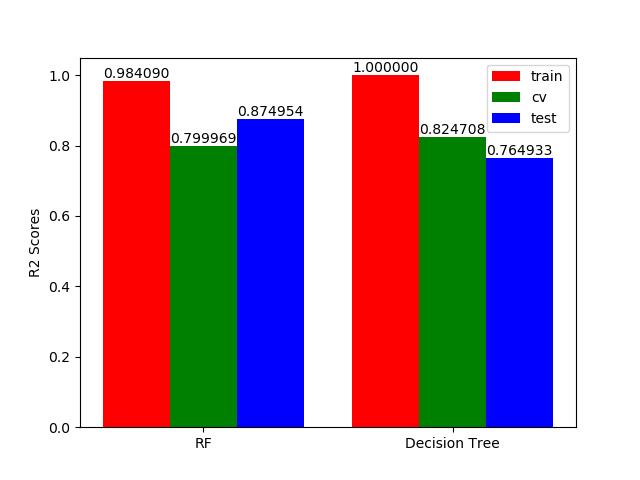
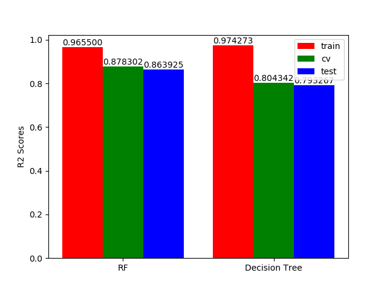

.. vim: set fileencoding=utf-8 :

.. _house_prices_pred_userguide:

===========
 User Guide
===========

This guide explains how to use this package and obtain results published in our
paper.  Results can be re-generated automatically by executing the following
command:

.. code-block:: sh

   (house_prices_env) $ python toolchain_all_params.py 
   (house_prices_env) $ python toolchain_all_params.py
   
   
Here are the plotting of the results of the executions above:
-------------------------------------------------------------

Algorithms prediction power with all the params of the input

Algorithms prediction power with only the relevant params 
