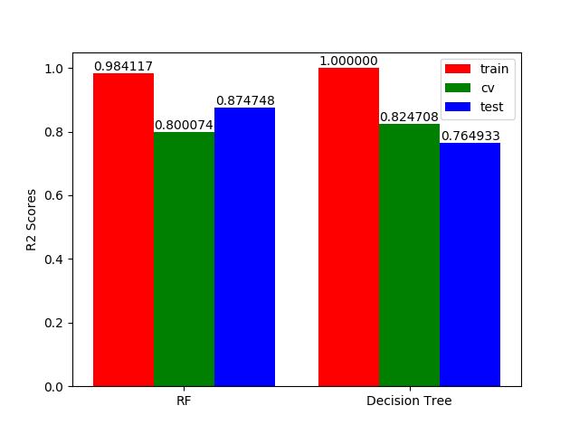
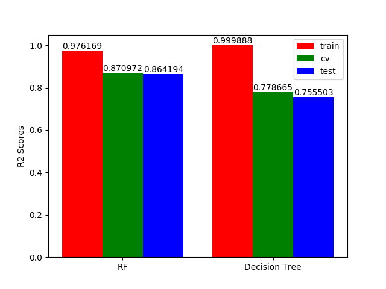

.. vim: set fileencoding=utf-8 :

.. _house_prices_pred_userguide:

===========
 User Guide
===========

This guide explains how to use this package and obtain results published in our
paper.

Hypothese 1
------------

The results for the first hypothese can be re-generated automatically by
executing the following command:

.. code-block:: sh

   $ run-house-prices-all-pred

R2 performance on the training, cv and testing set for a RF algorithm and
a Decision Tree algorithm when all the parameters are given at
the input.

Hypothese 2
------------

The results for the second hypothese can be re-generated automatically by
executing the following command:

.. code-block:: sh

   $ run-house-prices-relevant-pred

R2 performance on the training, cv and testing set for a RF algorithm and
a Decision Tree algorithm when only the relevant parameters are given at
the input.

